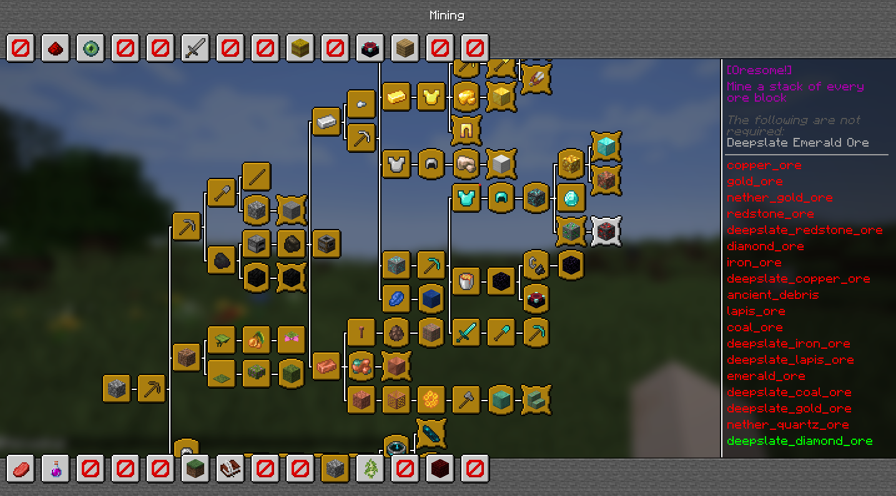

  <h1 align="center">AdvancementInfo Reloaded</h1>

    

  
  
  
   
  
  
  

# Overview
This mod significantly enhances the advancements info UI, expanding it to use most of your screen, especially when your GUI scale is high. No longer will you be confined to viewing your advancements in a tiny part of your screen.

# Background 
I decided to revive and enhance the original [AdvancementInfo](https://modrinth.com/mod/advancementinfo) mod, which was marked as end-of-life. Starting from scratch, I have reworked and improved the UI to make it more visually appealing.

**Future updates will focus on further enhancing the overall advancements experience.**

# What's New

- A completely new design that aligns with Minecraft's artistic direction.
- Easier scrolling capabilities.
- Memory retention of the selected achievement when the window is closed using the menu key (default: `L`).
- Ability to close the achievement details with the escape key.

# Version and Compatibility
This mod is a continuation of the original [AdvancementInfo](https://modrinth.com/mod/advancementinfo) mod, picking up from version 1.21 and beyond. It aims to keep the spirit of the original mod while adding significant improvements.

# Not Implemented Yet / Known Issues
- Configuration options are not yet available.
- Implementing an API to allow datapack creators to customize the UI directly from their datapacks.
- Advanced tracking of different triggers (e.g., _mining 10 blocks_ will show **4/10** instead of just the trigger name `mine_stone`).
- Achievement categories may display incorrectly on certain GUI scales.
- Potential incompatibility with other mods.
- Possible bugs as this is an alpha version.

# Support and Sponsorship
If you enjoy using this mod and would like to support its development, please consider sponsoring via [GitHub Sponsors](https://github.com/sponsors/42atomys) or [Patreon](https://patreon.com/42atomys). Your support will help improve and maintain this project, allowing for more frequent updates and new features.

# Special thanks
Special thanks to Gbl for her contributions so far on AdvancementInfo ❤️
