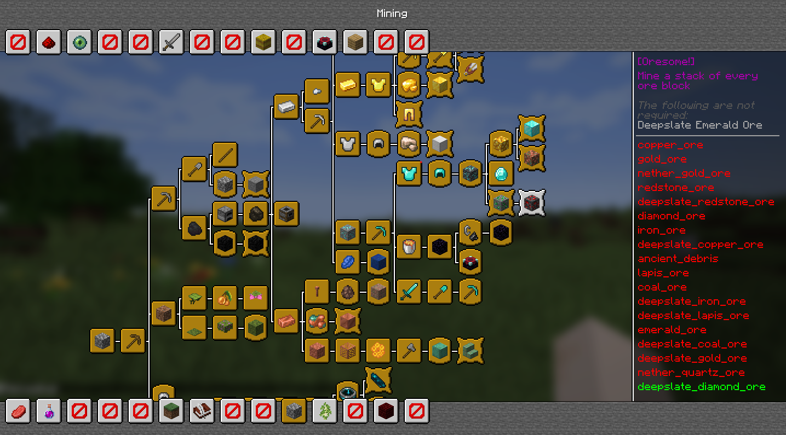

<p align="center">
  <h1 align="center">Advancements Reloaded</h1>
</p>    
<p align="center">
  <a href="https://modrinth.com/mod/advancements-reloaded" target="_blank"></a>
  <a href="https://modrinth.com/mod/advancements-reloaded" target="_blank"></a>
  <a href="https://modrinth.com/mod/advancements-reloaded" target="_blank"></a>
  <br />
  
  
  <a href="https://github.com/sponsors/42atomys" target="_blank"></a>
</p>

# Overview

This mod significantly enhances the Minecraft advancements UI with a modern, expanded interface that makes full use of your screen. Features include:

- **Expanded UI** - Utilizes most of your screen, especially on high GUI scales
- **Deterministic Ordering** - No more random tab and advancement ordering
- **Powerful Search** - Quickly find advancements and criteria across all tabs
- **Highly Configurable** - Customize colors, layout, and ordering to your preference
- **Modpack Friendly** - Full control over tab and advancement ordering for modpack creators



# Background

I decided to revive and enhance the original [Advancements Reloaded](https://modrinth.com/mod/advancementinfo) mod, which was marked as end-of-life. Starting from scratch, I have reworked and improved the UI to make it more visually appealing.

**Future updates will focus on further enhancing the overall advancements experience.**

# What's New

- A completely new design that aligns with Minecraft's artistic direction.
- Easier scrolling capabilities.
- Memory retention of the selected achievement when the window is closed using the menu key (default: `L`).
- Ability to close the achievement details with the escape key.

# Version and Compatibility

This mod is a continuation of the original [Advancements Reloaded](https://modrinth.com/mod/advancementinfo) mod, picking up from version 1.21 and beyond. It aims to keep the spirit of the original mod while adding significant improvements.

# Known Issues

- The mod may not work correctly with other mods that modify the advancements screen.

# Not Implemented Yet

- [x] ~~Implement a search engine to locate criterias and advancements~~ **Implemented in 0.9.0**
- [ ] Implementing an API to allow datapack creators to customize the UI directly from their datapacks.
- [ ] Advanced tracking of different triggers (e.g., _mining 10 blocks_ will show **4/10** instead of just the trigger name `mine_stone`).
- [x] ~~Configuration options are not yet available.~~ **Implemented in 0.2.0**
- [x] ~~Achievement categories may display incorrectly on certain GUI scales.~~ **Implemented in 0.2.0 by configuration**
- [x] ~~Support of Forge, NeoForge and Quilt.~~ **Implemented in 0.5.0**
- [x] ~~Modpack customization.~~ **Implemented in 0.10.0**


# For Modpack Creators

The mod provides flexible ordering options for both tabs and advancement rows.

## Tab Ordering

Customize tab order by editing `config/advancements_reloaded.json`:

```json
{
  "appearance": {
    "tabs_order": "CONFIGURED_ORDER"
  },
  "advanced_customization": {
    "custom_tabs_order": [
      "minecraft:story/root",
      "blazeandcave:mining/root",
      "minecraft:nether/root",
      "minecraft:end/root"
    ]
  }
}
```

**Note:** Tab IDs always end with `/root`. Unlisted tabs appear alphabetically after.

## Advancement Row Ordering

Control the order of advancement rows/branches within tabs:

**Three ordering modes:**
- `NONE`: Vanilla order (random)
- `ALPHABETIC`: Sorted by title (default)
- `CONFIGURED_ORDER`: Custom order

**Simple Example - Order main branches:**

```json
{
  "appearance": {
    "advancements_order": "CONFIGURED_ORDER"
  },
  "advanced_customization": {
    "custom_advancements_order": [
      "minecraft:story/mine_stone",
      "minecraft:story/upgrade_tools",
      "minecraft:story/smelt_iron"
    ]
  }
}
```

**Advanced Example - Order branches AND their children:**

```json
{
  "advanced_customization": {
    "custom_advancements_order": [
      "modpack:quest/main",
      "modpack:quest/side",
      "modpack:quest/main/chapter_1",
      "modpack:quest/main/chapter_2"
    ]
  }
}
```

**Result:** Listed advancements appear first in your order, unlisted ones are sorted alphabetically after.

**Finding Advancement IDs:**
- File: `data/modpack/advancement/quest/main.json`
- ID: `modpack:quest/main`


# Support and Sponsorship

If you enjoy using this mod and would like to support its development, please consider sponsoring via [GitHub Sponsors](https://github.com/sponsors/42atomys) or [Patreon](https://patreon.com/42atomys). Your support will help improve and maintain this project, allowing for more frequent updates and new features.

## How to Update the Mod for a new Minecraft Version

1. Open `./gradlew.properties` and update the version number according to the URL.

2. Run the following commands:

```bash
./gradlew --refresh-dependencies
./gradlew clean
./gradlew genSources
./gradlew build
```

3. Refactor and improve any problematic code as necessary.

4. Test the mod in the new Minecraft version for each loader (Fabric, NeoForge, Quilt).

# Special thanks

Special thanks to Gbl for her contributions so far on AdvancementsInfo ❤️
